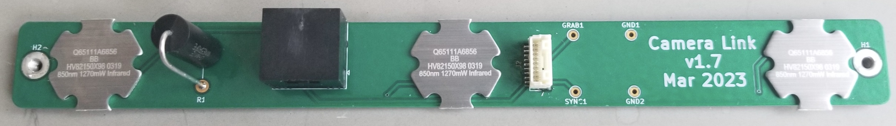
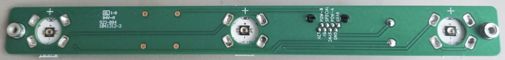
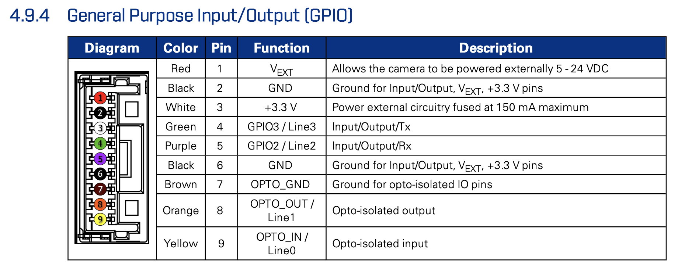

# Camera Link
This PCB connects a [Chameleon3 USB3](https://www.flir.com/products/chameleon3-usb3/?model=CM3-U3-31S4C-CS) camera to [pyControl](https://pycontrol.readthedocs.io/en/latest/).
It takes "frame grab" and "sync pulse" signals generated by pyControl and coming out of a [D-Series Breakout Board](https://github.com/Karpova-Lab/pyControl-D-series-Breakout) 
and routes them into the GPIO pins of the camera.

Additionally, the PCB has 3 controllable high power IR LEDs that are used for the camera to see in the dark.

## PCB 
[Order PCB from OSH Park](https://oshpark.com/shared_projects/eBqWROZ7)

| Qty | Reference                | Description       | Value/MPN                                                                                                                                    | 
|-----|--------------------------|-------------------|----------------------------------------------------------------------------------------------------------------------------------------------|
| 3   | D1, D2, D3               | 850 nm LED        | [LST1-01F09-IR01-00](https://www.digikey.com/en/products/detail/new-energy/LST1-01F09-IR01-00/9445943?s=N4IgTCBcDaIIwDYDsYC0c4FYAMIC6AvkA)   | 
| 2   | H1, H2                   | Threaded standoff | [24882](https://www.digikey.com/en/products/detail/keystone-electronics/24882/9921822?s=N4IgTCBcDaIMwDYC0YAsAOdYkEYkDkAREAXQF8g)             | 
| 1   | J1                       | 9-pin socket      | [BM09B-NSHSS-TBT](https://www.digikey.com/en/products/detail/jst-sales-america-inc/BM09B-NSHSS-TBT-LF-SN/3313615)                            | 
| 1   | J2                       | RJ45 jack         | [E5J88-00LJG2-L](https://www.digikey.com/en/products/detail/pulse-electronics/E5J88-00LJG2-L/1785312?s=N4IgTCBcDaIKxwMwFoxgGwBZkDkAiIAugL5A) | 
| 1   | R1                       | 5 watt resistor   | [5Ω](https://www.digikey.com/en/products/detail/ohmite/WNE5R0FET/3114558?s=N4IgTCBcDaIOoDkCiBWATgBgGYFMAuAxniALoC%2BQA)                      | 

[View interactive BOM](https://karpova-lab.github.io/camera-link/ibom)

## GPIO cable
- [plug](https://www.digikey.com/en/products/detail/jst-sales-america-inc/NSHR-09V-S/3313624)
- [8" pre-crimped wires](https://www.digikey.com/en/products/detail/jst-sales-america-inc/ASSHLSSHL28K203/9924242?s=N4IgjCBcoOw1oDGUBmBDANgZwKYBoQB7KAbRACYAOcgBgFYBmEAXQIAcAXKEAZQ4CcAlgDsA5iAC+BGJQQhkkdNnxFS4AGwM6MdS3ZdIvASPFSQDMPGjzUmXAWKQyAFhrOds1iE7c+QsZIEALQQ1gpK9qpOIM50dCxmQc5y4XYqjmRg6mD0CRISQA)
## Camera
- [Technical Rererence](docs//CM3-U3-Technical-Reference.pdf)
- [Lens](https://www.flir.com/products/computar-a4z2812cs/)

| GPIO pin | GPIO Color | GPIO Function | RJ45 Pin | pyControl Function | Purpose                                                  |
|----------|------------|---------------|----------|--------------------|----------------------------------------------------------|
| 4        | Green      | GPIO3/Line3   | 1        | DIO_A              | pyControl sends square wave to camera to grab each frame |
| 9        | Yellow     | OPTO_IN/Line0 | 4        | DIO_B              | pyControl sends random sync pulse                        |
| 6        | Black      | GND           | 2        | Ground             | Ground                                                   |
| 7        | Brown      | OPTO_GND      | 2        | Ground             | Ground                                                   |

## Software
- [Bias](https://github.com/iorodeo/bias)
- [pyControl synchronization](https://pycontrol.readthedocs.io/en/latest/user-guide/synchronisation/)
